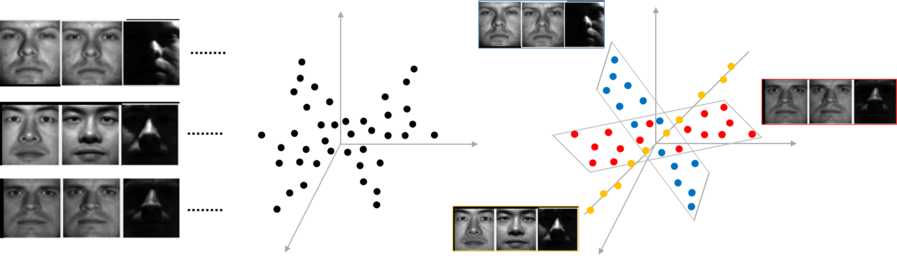
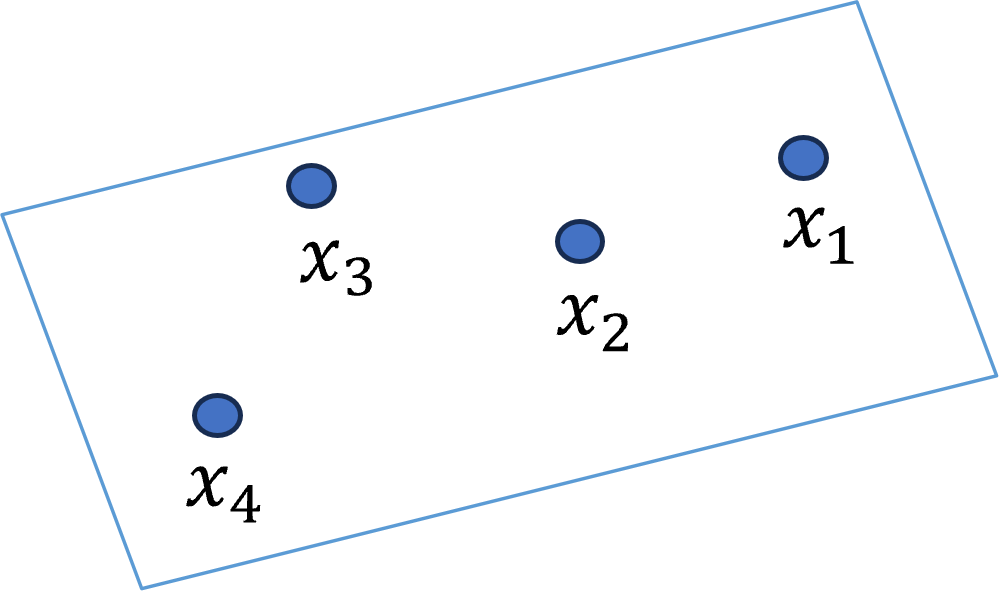
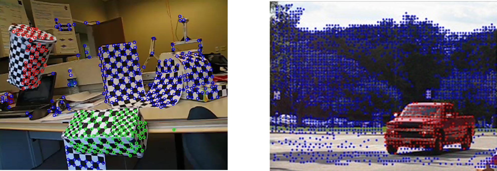
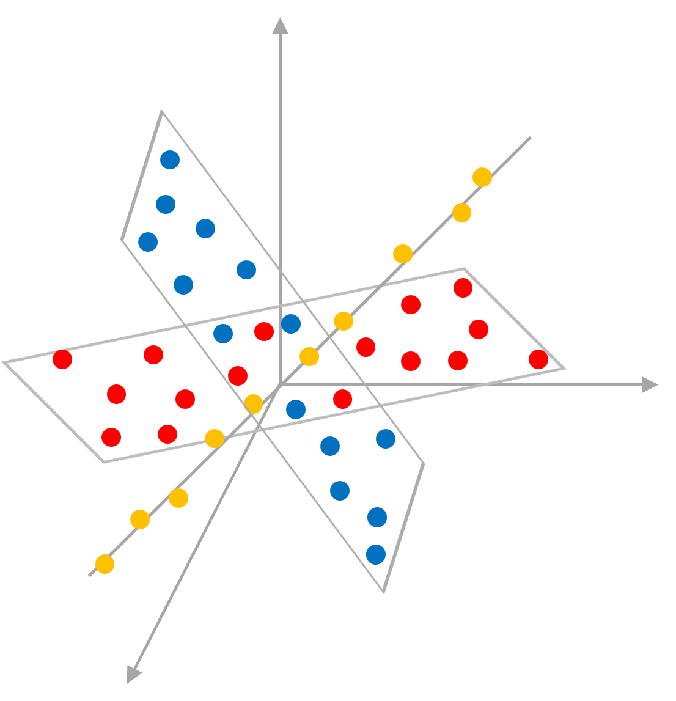
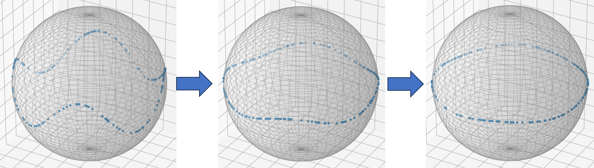
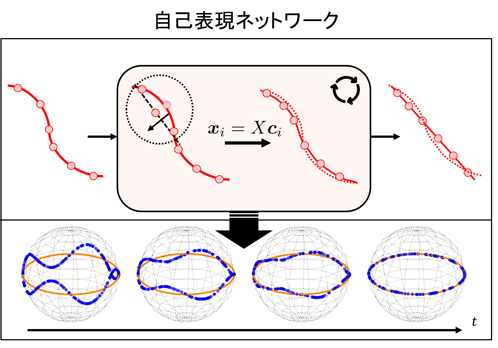

# Master

## 背景

- コンピュータビジョン分野をはじめとする様々な領域で、大規模なデータベースの利用可能性が急増
- 現代の機械学習技術、特に深層学習はビッグデータの解析において大きな成功を収めていますが、これらの手法は一般に大量のラベル付きデータを必要とし、その準備はしばしばコストがかかります 。したがって、ラベルのない大規模データからパターンやクラスターを抽出することは、依然として重要な問題となっています 。

### 部分空間クラスタリング
高次元データは低次元の部分空間の集合に属しているという仮定に基づいて、各データ点がどの低次元部分空間に属するかを特定し、クラスタリングする

  

### 自己表現モデル
- 自己表現モデルが成功している手法の一つ
- 各データ点は同じ部分空間にある他の点の線形結合として表現される
例：𝑥_1=𝑐_12 𝑥_2+ 𝑐_13 𝑥_3+ 𝑐_14 𝑥_4

  

### 応用例
- モーションセグメンテーション
独立して動いている部分を、それぞれ異なるグループとして識別

  

## 課題・目標
- 部分空間クラスタリングは、クラスタ内のデータが線形部分空間上にあると仮定している

  

- 高次元データは複雑な非線形多様体上に分布している
- 複雑な非線形データから、線形な部分空間をより正確に識別するための非線形な学習能力を高める

  

## 提案手法
自己表現ネットワークの多層構造により多様体を考慮した部分空間学習の実現を目指す

  

## 今後の予定
- 多様体を考慮した部分空間ネットワークの構築
- 合成＆実環境データによる定量的な評価
- ネットワークの軽量化

## 参考文献
1. Parsons, Lance, Ehtesham Haque, and Huan Liu. "Subspace clustering for high dimensional data: a review." Acm sigkdd explorations newsletter 6.1 (2004): 90-105..
2. Elhamifar, Ehsan, and René Vidal. "Sparse subspace clustering: Algorithm, theory, and applications." IEEE transactions on pattern analysis and machine intelligence 35.11 (2013): 2765-2781.
3. Yang, Michael Ying, et al. "Motion Segmentation Using Global and Local Sparse Subspace Optimization." Photogrammetric Engineering & Remote Sensing 83.11 (2017): 769-778.

## 資料

フル資料: [Manifold-Aware Representation Learning for Deep Subspace Clustering (PDF)](./image/Manifold-Aware%20Representation%20Learning%20for%20Deep%20Subspace%20Clustering.pdf)
